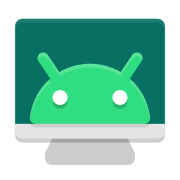

<div align="center">



# Mirra 🪞

**Free, open-source Android & iOS screen mirroring for Windows**

Mirror your phone, take screenshots, record your screen — all from a sleek floating toolbar.

[](https://github.com/barigalasunil/Mirra/releases/latest)
[](LICENSE)
[](https://github.com/barigalasunil/Mirra/releases/latest)
[](https://github.com/barigalasunil/Mirra/stargazers)

---

[📥 Download](#-download) • [🚀 Quick Start](#-quick-start) • [📱 Android Setup](#-android-setup) • [🍎 iOS Setup](#-ios-setup) • [🔨 Build from Source](#-build-from-source) • [❓ FAQ](#-faq)

</div>

---

## ✨ What is Mirra?

Mirra is a lightweight Windows desktop app that lets you **mirror and control your Android or iOS device** directly on your PC — no subscription, no ads, completely free.

It sits as a compact **floating toolbar** beside your phone's mirrored screen, giving you one-click access to screenshots, screen recording, and device controls. Think Vysor Pro, but open-source.

<div align="center">

| | Android | iOS |
|:--|:---:|:---:|
| 🖥 Screen Mirroring | ✅ | 🔜 |
| 📸 Screenshot (Copy / Save) | ✅ | 🔜 |
| 🎥 Screen Recording (MP4) | ✅ | 🔜 |
| ☀️ Keep Screen Awake | ✅ | — |
| 📶 Wi-Fi Connect | ✅ | 🔜 |
| 📌 Always-on-top toolbar | ✅ | 🔜 |
| 🔌 USB + Wireless | ✅ | 🔜 |

</div>

---

## 🎬 Video Tutorials

### Android — Getting Started

> 📺 **Tutorial coming soon** — [Subscribe to be notified](https://github.com/barigalasunil/Mirra)
>
> `[Android Tutorial Video Placeholder]`
>
> <!-- How to add your YouTube video when ready:
> 1. Upload your tutorial to YouTube
> 2. Replace YOUR_VIDEO_ID with your actual video ID (the part after ?v=)
> 3. Remove the comment markers around the two lines below
> [](https://www.youtube.com/watch?v=YOUR_VIDEO_ID)
> *▶ Click to watch: Mirra Android Setup & Screen Mirroring Tutorial*
> -->

### iOS — AirPlay Mirroring

> 📺 **Tutorial coming soon** — [Subscribe to be notified](https://github.com/barigalasunil/Mirra)
>
> `[iOS Tutorial Video Placeholder]`
>
> <!-- How to add your YouTube video when ready:
> 1. Upload your tutorial to YouTube
> 2. Replace YOUR_VIDEO_ID with your actual video ID
> 3. Remove the comment markers around the two lines below
> [](https://www.youtube.com/watch?v=YOUR_VIDEO_ID)
> *▶ Click to watch: Mirra iOS AirPlay Mirroring Tutorial*
> -->

---

## 📥 Download

Go to the **[Releases page](https://github.com/barigalasunil/Mirra/releases/latest)** and pick the right file:

| File | Best for | Size |
|------|----------|------|
| `Mirra-portable.exe` | Android + iOS, no install needed | ~200 MB |
| `Mirra-Setup.exe` | Android + iOS, with Start Menu shortcut | ~200 MB |
| `Mirra-Android-portable.exe` | Android only, smaller download | ~80 MB |
| `Mirra-iOS-portable.exe` | iPhone only | ~120 MB |

> ⚠️ **Important:** Download the `.exe` directly from the **Releases page** — not from the Actions tab.
> The portable `.exe` runs directly — no installation, no admin rights needed. Just double-click.

---

## 🚀 Quick Start

### Option A — Portable (recommended)
1. Download `Mirra-portable.exe` from [Releases](https://github.com/barigalasunil/Mirra/releases/latest)
2. Double-click to launch — no installation needed
3. Connect your device (USB for Android, Wi-Fi for iOS)
4. Click **▶ Start Mirroring**

### Option B — Installer
1. Download `Mirra-Setup.exe` from [Releases](https://github.com/barigalasunil/Mirra/releases/latest)
2. Run the installer and follow the steps
3. Launch Mirra from your Desktop or Start Menu shortcut

> ⏱ **First launch takes 5–10 seconds** for the toolbar icons to appear. This is a known limitation of the current build. The app is fully functional once icons load — subsequent interactions are instant.

---

## 📱 Android Setup

### Step 1 — Enable USB Debugging

1. Open **Settings** on your Android phone
2. Go to **About Phone**
3. Tap **Build Number** 7 times until you see *"You are now a developer!"*
4. Go back to **Settings → Developer Options**
5. Enable **USB Debugging**

> Can't find Developer Options? Try Settings → Software Information → Build Number.

### Step 2 — Connect & Mirror

1. Plug your phone into your PC via **USB cable**
2. Tap **"Allow"** on the USB Debugging prompt on your phone
3. Open Mirra — your device appears automatically in the toolbar
4. Click **▶ Start Mirroring**

The mirror window opens alongside the toolbar. Use your mouse to interact with the device.

### Wireless Mirror (same Wi-Fi)

1. Connect via USB first (one time only)
2. Click **⋮ → Connect via Wi-Fi**
3. Click **Auto-discover IP** or enter your phone's IP manually
4. Click Connect — unplug the cable and continue wirelessly

---

## 🍎 iOS Setup (AirPlay)

iOS mirroring uses Apple's built-in AirPlay — **no jailbreak, no app install on your iPhone.**

### Requirements

- ✅ iPhone and PC on the **same Wi-Fi network**
- ✅ [iTunes](https://apps.microsoft.com/detail/9pb2mz1zmb0s) installed on Windows
- ✅ iOS 12 or later

### Step 1 — Prepare Windows
1. Install **iTunes** from the [Microsoft Store](https://apps.microsoft.com/detail/9pb2mz1zmb0s)
2. Open iTunes once to complete driver installation

### Step 2 — Start iOS Mirroring
1. Open Mirra
2. Click **▶ Start iOS Mirror**
3. Allow Mirra through **Windows Firewall** when prompted ← important!
4. Wait for the toast: *"On your iPhone: Control Center → Screen Mirroring → Mirra"*

### Step 3 — Connect from iPhone
1. Swipe down from the top-right corner to open **Control Center**
2. Tap **Screen Mirroring** (rectangle with triangle icon)
3. Select **"Mirra"** from the list
4. Your iPhone screen appears on your PC ✅

### iOS Troubleshooting

| Problem | Solution |
|---------|----------|
| "Mirra" not in AirPlay list | Confirm same Wi-Fi. Toggle Wi-Fi off/on on iPhone. |
| Black screen after connecting | Tap Screen Mirroring → Mirra again to reconnect |
| Need to reconnect every time | Click Stop iOS Mirror → Start iOS Mirror → reconnect from iPhone |
| Firewall blocked | Run PowerShell fix below |
| Still not visible | Restart router, or test with iPhone mobile hotspot |

**Firewall fix (PowerShell as Administrator):**
```powershell
netsh advfirewall firewall add rule name="Mirra-UxPlay" dir=in action=allow protocol=any program="C:\Path\To\uxplay.exe"
```

---

## 📸 Screenshot

Click the **📷 camera icon** any time. A popup appears on the mirror window with:

- **Copy Image** — copies to clipboard (paste into WhatsApp, Slack, email...)
- **Save As…** — file save dialog, saves as PNG to your chosen location

> Android screenshots work even without an active mirror session.

---

## 🎥 Screen Recording (Android)

1. Start mirroring first
2. Click the **⏺ record icon**
3. A **save dialog appears before recording starts** — choose file name and folder
4. Recording begins — mirroring continues uninterrupted
5. Click **⏹ stop** — MP4 saved, folder opens automatically

**Quality:** H.264 · MP4 · 8 Mbps · 60 fps · 1080p max

> iOS screen recording is planned for a future release.

---

## ⚙️ Controls Reference

| Icon | Action | Notes |
|------|--------|-------|
| ▶ / ⏹ | Start / Stop Mirroring | Opens the mirror window |
| 📷 | Screenshot | Copy or Save popup |
| ⏺ / ⏹ | Start / Stop Recording | Android only · save dialog first |
| ☀️ | Keep Awake | Prevents screen sleeping while connected |
| 📌 | Pin on top | Toolbar stays above all windows |
| ⋮ | More options | Wi-Fi · Theme · Dev Tools |

---

## 🔨 Build from Source

### Prerequisites
- [Node.js 18+](https://nodejs.org/) · npm 9+ · Git · Windows 10/11 64-bit

### Steps

```bash
git clone https://github.com/barigalasunil/Mirra.git
cd Mirra
npm run install-app   # install dependencies
npm run dev           # development mode
npm run build         # Android + iOS combined
npm run build:android # Android only
npm run build:ios     # iOS only
npm run build:all     # all three flavours
```

### Build outputs
```
mirrordesk/
├── release/combined/   →  Mirra-*-portable.exe  +  Mirra-*-setup.exe
├── release/android/    →  Mirra-Android-*-portable.exe  +  setup
└── release/ios/        →  Mirra-iOS-*-portable.exe  +  setup
```

---

## ❓ FAQ

**Q: Is Mirra free?**
Yes — free forever, no ads, no subscription, Apache 2.0 open-source.

**Q: Does it need internet?**
No. Mirroring is fully local — USB or home Wi-Fi only.

**Q: Why 5–10 seconds on first launch?**
The current build starts a local server on first run. Will be improved in a future release.

**Q: Can I control my Android from the PC?**
Yes — mouse clicks become touch events. iOS is view-only (AirPlay limitation).

**Q: Windows Defender flags the exe.**
False positive. Click "More info → Run anyway." Build from source to verify.

**Q: iPhone detected but won't mirror.**
Click "Start iOS Mirror" first, then use Control Center → Screen Mirroring on iPhone.

---

## 🛡 Credits & Licenses

| Project | Author | License | Used for |
|---------|--------|---------|----------|
| [scrcpy](https://github.com/Genymobile/scrcpy) | Genymobile / Romain Vimont | Apache 2.0 | Android mirroring |
| [UxPlay](https://github.com/FDH2/UxPlay) | FDH2 | GPL 3.0 | iOS AirPlay receiver |
| [pymobiledevice3](https://github.com/doronz88/pymobiledevice3) | doronz88 | GPL 3.0 | iOS device detection |
| [Electron](https://www.electronjs.org) | OpenJS Foundation | MIT | Desktop framework |
| [React](https://react.dev) | Meta | MIT | UI |
| [Tailwind CSS](https://tailwindcss.com) | Tailwind Labs | MIT | Styling |
| [Lucide](https://lucide.dev) | Lucide Contributors | ISC | Icons |

---

## 🤝 Contributing

1. Fork the repo
2. Create your branch: `git checkout -b feature/my-feature`
3. Commit: `git commit -m 'feat: add my feature'`
4. Push: `git push origin feature/my-feature`
5. Open a Pull Request

---

## 📬 Support

- 🐛 **Bugs** → [Open an Issue](https://github.com/barigalasunil/Mirra/issues/new)
- 💡 **Feature requests** → [Open an Issue](https://github.com/barigalasunil/Mirra/issues/new)
- ⭐ **Find Mirra useful?** → [Give it a star!](https://github.com/barigalasunil/Mirra/stargazers)

---

<div align="center">

Made with ❤️ by [Sunil Barigala](https://github.com/barigalasunil)

[Apache 2.0 License](LICENSE) · Powered by [scrcpy](https://github.com/Genymobile/scrcpy) & [UxPlay](https://github.com/FDH2/UxPlay)

</div>
